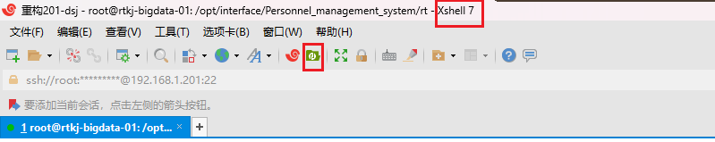

# 项目目录
/opt/interface/Personnel_management_system

## 上传到服务器上



命令解压tar 

``` shell
tar -vxf xxx.tar
```


进入到带有docker-compose.yml的目录下才能docker部署


# docker部署

## 部署命令

一键启动部署
``` bash
# 1. 构建镜像并启动容器（-d 表示在后台运行） 
docker compose up --build -d
```


查看运行状态
``` shell
docker compose ps
```


查看日志
``` shell
docker compose logs -f --tail 100
```

停止并删除容器
``` shell
docker compose down
```

更新代码后重新部署
``` shell
docker compose up --build -d
```


### 问题1：项目一键部署过程中有网络问题

解决办法1：可以在网络可以的电脑上使用docker下载对于的docker版本的包，然后整合到项目中


第一步：在本地电脑下载镜像
``` bash
docker pull redis:alpine 
docker pull mysql:8.0
```

第二步：将镜像打包成文件
下载完成后，将镜像导出为 `.tar` 压缩包：
``` bash
# 导出 Redis 
docker save -o redis_alpine.tar redis:alpine 
# 导出 MySQL 
docker save -o mysql_8.0.tar mysql:8.0
```

第三步：上传文件到服务器


第四步：在服务器上加载镜像
``` bash
docker load -i redis_alpine.tar 
docker load -i mysql_8.0.tar
```

加载完成后，你可以运行 `docker images` 查看，应该能看到这两个镜像已经躺在服务器里了。


``` bash
docker pull redis:alpine 
docker pull mysql:8.0
```